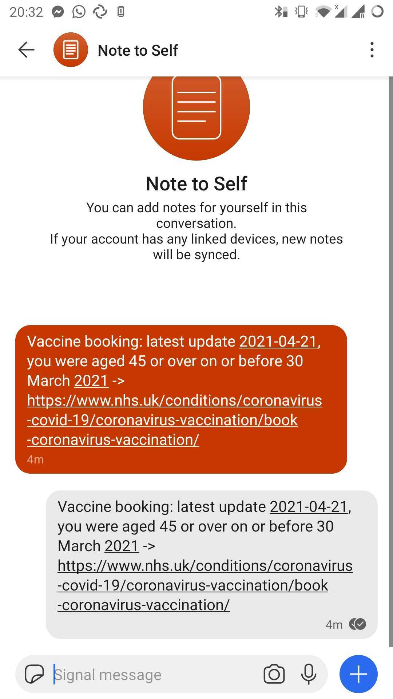

# Vaccine booking notifications

Project to scrape the [UK COVID-19 vaccine booking website](https://www.nhs.uk/conditions/coronavirus-covid-19/coronavirus-vaccination/book-coronavirus-vaccination/), and send notifications to [Signal](https://signal.org/en/) through [`signal-cli`](https://github.com/AsamK/signal-cli).

Assumptions:
* the latest website update data is at a fixed location on the page
* the first eligibility criterion is the most interesting and most likely to change (age)

A notification is sent every time the website is updated and the change is not yet stored in a database.

To set things up, install `signal-cli` in a way that it is available in your path to be called. Link to your Signal account.

Copy `scraper.ini.template` to `scraper.ini` and update the relevant values (database, sender and receiver phone number, Signal config path).

Install the required Python dependencies:

```shell
pip install -r requirements.txt
```

Run the script to scrape and store the results in the database.



(Message shown twice in Note to Self, as this is the way it gets a notification and not just create a note. Only an issue if you are sending message to yourself.)
